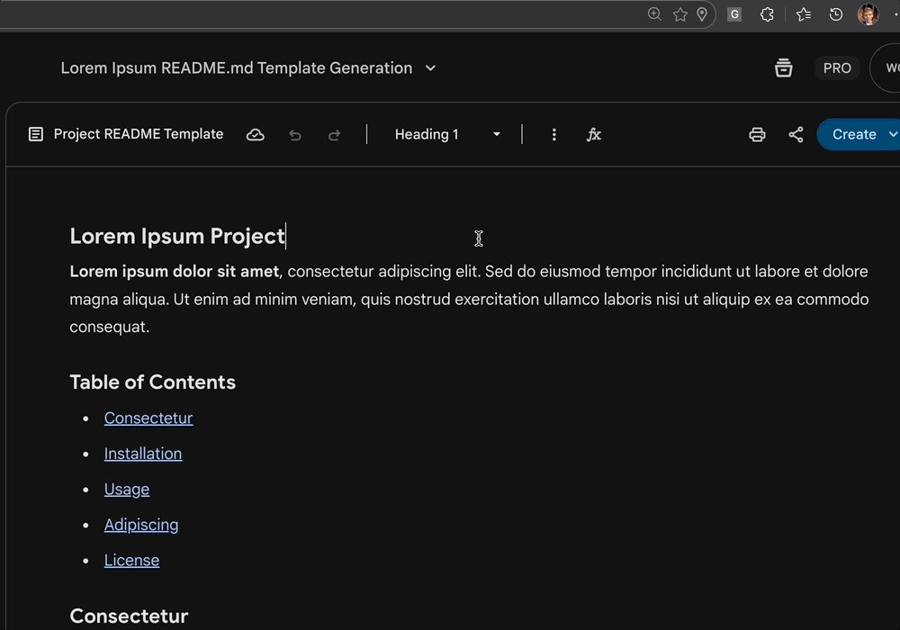

<div align="center">

# Canvas 2 Markdown Chrome Extension


  <br />

  <a href="https://www.buymeacoffee.com/imnotamember" target="_blank"></a>



</div>

---

A professional Chromium extension built with React and Vite that converts HTML content (specifically from LLM canvases like Gemini) into clean, lint-compliant Markdown.

It automatically detects the language of code blocks, fixes common Markdown linting errors (MD007, MD032, etc.), and provides a visual diff of the source HTML vs. the generated Markdown.

## Features

- 🚀 **Auto-Capture**: Automatically grabs selected text from the active tab upon opening.
- 🧠 **Smart Language Detection**: Analyzes code blocks to detect Python, JavaScript, Shell, JSON, etc., if the source HTML lacks language tags.
- 🧹 **Lint-Compliant Output**:
  - **Lists**: Enforces 4-space indentation for nested lists to satisfy CommonMark standards.
  - **Spacing**: Normalizes "loose" lists into "tight" lists (MD032).
  - **Headers**: Converts "emphasis headings" (`**Heading**`) into real Markdown headers (`### Heading`) (MD036).
  - **Code Blocks**: Ensures proper blank lines around fenced blocks (MD031).
  - **Files**: Ensures single trailing newline (MD047).
- 🌓 **Visual Editor**: Split-pane view to inspect the source HTML and copy the Markdown result.

## Tech Stack


## Development

### Prerequisites

- Node.js (v18+)
- npm

### Setup

1. Clone the repository

```shell
git clone [https://github.com/imnotamember/canvas2markdown.git](https://github.com/imnotamember/canvas2markdown.git)
cd canvas2markdown
```

1. Install dependencies:  
Bash  

```shell  
npm install  

```

1. Run dev server (browser view):  
Bash  

```shell  
npm run dev  

```

### Building for Chrome/Edge

1. Build the project:  
Bash  

```shell  
npm run build  

```

1. Open Chrome/Edge and navigate to `chrome://extensions`.
1. Enable **Developer Mode** (top right switch).
1. Click **Load unpacked**.
1. Select the `dist` folder generated by the build command.

## Usage

1. Select content on any web page (or open a Gemini Canvas).
1. Click the extension icon.
1. The HTML is automatically converted to Markdown.
1. Click **Copy** to copy the clean Markdown to your clipboard.

## Contributing

Contributions are welcome! Please check out the [CONTRIBUTING.md](https://www.google.com/search?q=CONTRIBUTING.md) file for guidelines on how to proceed.

## License

MIT
